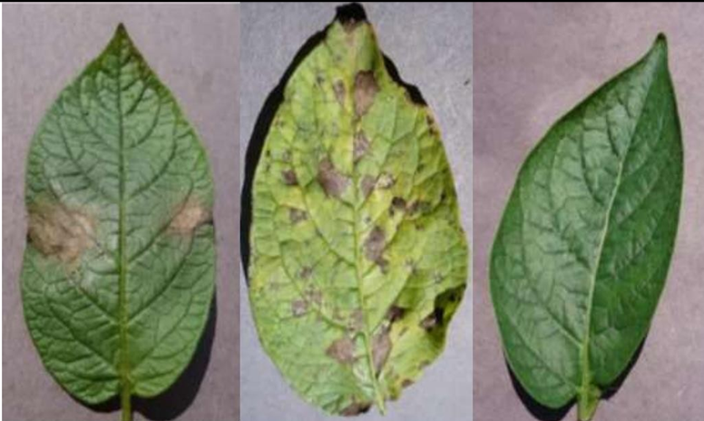

# Potato Leaf Disease Classifier using Convolutional Neural Networks (CNN)

## Overview
This repository contains a CNN-based Potato Leaf Disease Classifier. The model is designed to classify various potato leaf diseases using Convolutional Neural Networks (CNNs). Its primary aim is to aid farmers in early disease detection and effective management strategies.

## Features
- **CNN Architecture**: Implemented using TensorFlow/Keras, the model architecture efficiently learns and classifies different potato leaf diseases.
- **Dataset**: Utilizes a comprehensive dataset of labelled potato leaf disease images collected from diverse sources.
- **Training and Validation**: Scripts for data preprocessing, model training, and validation ensure robust performance.
- **Evaluation**: Metrics and evaluation methods to assess model accuracy and performance.
- **Prediction**: Allows users to input images for disease prediction using the trained model.
- **Documentation**: Detailed usage instructions, dataset insights, and model architecture information.

## Uniqueness in This Project
One of the standout aspects of this project is the integration of the Inception_v3 model. This addition has significantly improved the model's performance, elevating classification accuracy and enhancing overall disease detection capabilities. Leveraging the advanced architecture of Inception_v3 has been instrumental in achieving more precise and reliable disease identification.

## Usage
**Clone the Repository**git clone https://github.com/bishalganai05/Potato-Leaf-Disease-Classifier.git
